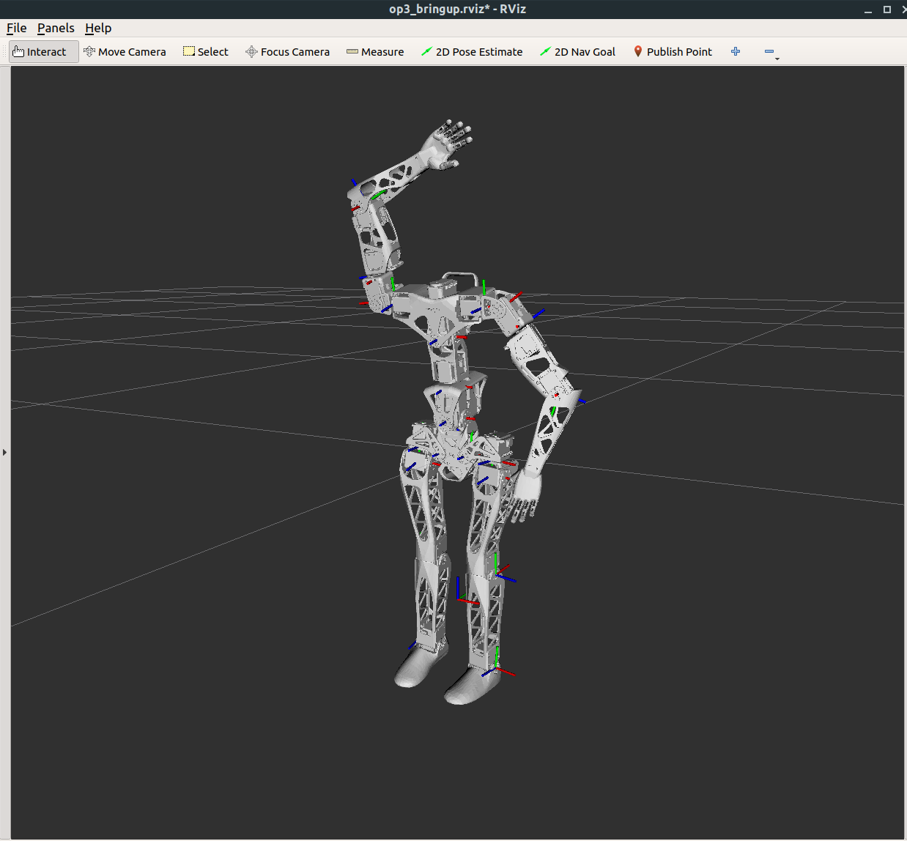

# IAwake-AI

## Getting started with the I, Awake robot platform.

The I, Awake project is presently based on the ROBOTIS OP3 robot and Poppy Robot projects.  More information can be found about each at:

* http://emanual.robotis.com/docs/en/platform/op3/introduction/
* https://www.poppy-project.org/en/

tl;dr We performed robot brain surgery and placed the OP3 brain in a modified Popppy Robot body.

## Installing the robot

We recommend setting up an Ubuntu 18.04 (Bionic) machine and install the latest ROS desktop:

Following instructions here: http://wiki.ros.org/melodic/Installation/Ubuntu

```
sudo apt install ros-melodic-desktop
```




### Create the robot's workspace:
```
cd ~/
mkdir -p SOFTWARE/OP3/src
cd ~/SOFTWARE/OP3
catkin_make
source ~/SOFWARE/ROS/src/$OVERLAY_PKG/devel/setup.bash
echo "source ~/SOFTWARE/OP3/devel/setup.bash" >> ~/.bashrc
```

### Clone all the repositories
```
cd ~/SOFTWARE/OP3/src
git clone https://github.com/IAwake-AI/ROBOTIS-Optimization.git
git clone https://github.com/IAwake-AI/ROBOTIS-OP3-Tools.git
git clone https://github.com/IAwake-AI/ROBOTIS-OP3-Demo.git
git clone https://github.com/IAwake-AI/ROBOTIS-OP3-Common.git
git clone https://github.com/IAwake-AI/ROBOTIS-OP3.git
git clone https://github.com/IAwake-AI/ROBOTIS-Framework.git
git clone https://github.com/IAwake-AI/humanoid_navigation.git
```

#### The ROBOTIS repos
```
git clone https://github.com/ROBOTIS-GIT/DynamixelSDK.git
git clone https://github.com/ROBOTIS-GIT/ROBOTIS-Framework-msgs.git
git clone https://github.com/ROBOTIS-GIT/ROBOTIS-Math.git
git clone https://github.com/ROBOTIS-GIT/ROBOTIS-OP3-msgs.git
git clone https://github.com/ROBOTIS-GIT/ROBOTIS-Utility.git

```

#### Extra ROS packages
```
git clone https://github.com/ROBOTIS-GIT/face_detection.git
git clone https://github.com/ahornung/humanoid_msgs.git
git clone https://github.com/ros-perception/image_pipeline.git
git clone https://github.com/ros-planning/navigation.git
git clone https://github.com/ros-planning/navigation_msgs.git
git clone https://github.com/OctoMap/octomap_mapping.git
git clone https://github.com/OctoMap/octomap_ros.git
git clone https://github.com/RobotWebTools/rosbridge_suite.git
git clone https://github.com/pantor/ros-control-center.git
git clone https://github.com/ROBOTIS-GIT/ROBOTIS-OP-Series-Data.git
```

## Other dependencies
```
sudo apt install ros-melodic-octomap* 
sudo apt install ros-melodic-rosbridge-server ros-melodic-web-video-server
sudo apt install ros-melodic-geometry2 ros-nav-msgs
sudo apt install libsdl1.2-dev libsdl-image1.2-dev libsdl-mixer1.2-dev libsdl-ttf2.0-dev
sudo apt install ros-melodic-ros-control ros-melodic-ros-controllers
cd ~/SOFTWARE
git clone https://github.com/sbpl/sbpl.git
cd sbpl
mkdir build
cd build
cmake ..
make
sudo make install
cd ~/SOFTWARE
```

You may also need to install the QT5 library (https://wiki.qt.io/Install_Qt_5_on_Ubuntu) and add to your ~/.bashrc:
```
export CMAKE_PREFIX_PATH=/<location where you installed QT>/:$CMAKE_PREFIX_PATH
```


# Build all the ROS packages
```
cd ~/SOFTWARE/OP3
catkin_make
```


# Update any robot params, review the files in these directories:
```
cd ~/SOFTWARE/OP3/src/ROBOTIS-OP3/op3_manager/config
cd ~/SOFTWARE/OP3/src/ROBOTIS-OP3-Common/op3_description/urdf
cd ~/SOFTWARE/OP3/src/ROBOTIS-Framework/robotis_device/devices/dynamixel
```

# Edit any launch files
```
cd ~/SOFTWARE/OP3/src/ROBOTIS-OP3-Demo/op3_bringup/launch
cd ~/SOFTWARE/OP3/src/ROBOTIS-OP3-Common/op3_description/launch
cd ~/SOFTWARE/OP3/src/ROBOTIS-OP3-Common/op3_gazebo/launch
```


# Launching the robot


## start a simulated demo
```
roslaunch op3_manager op3_gazebo.launch
roslaunch op3_gazebo robotis_world.launch
```

-OR-

## start a real robot
```
roslaunch op3_bringup op3_bringup.launch
```

## start the visualization utilities and demo
```
roslaunch op3_bringup op3_bringup_visualization.launch  
roslaunch op3_description op3_walking.launch
roslaunch op3_gui_demo op3_demo.launch
roslaunch op3_offset_tuner_client op3_offset_tuner.launch
```

## create demo behavior/motion sequences
```
roslaunch op3_action_editor op3_action_editor.launch
```

## Enable rosbridge server for websockets
```
roslaunch rosbridge_server rosbridge_websocket.launch
```


